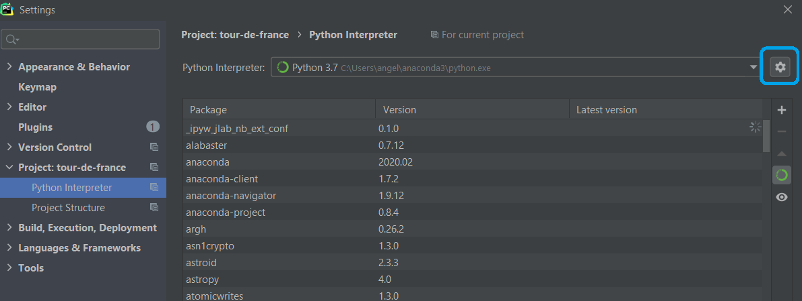
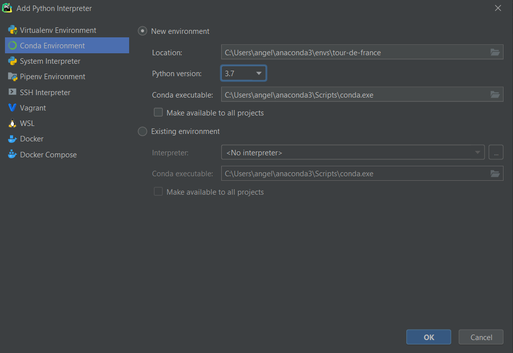
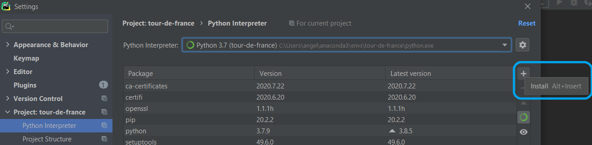
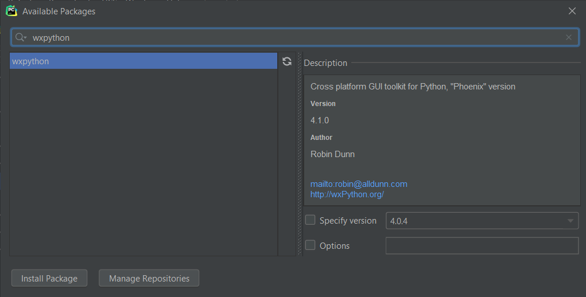
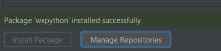
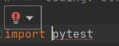
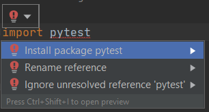
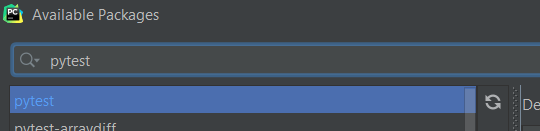

# Python Interpreter & wxPython
This tutorial shows you how to configure a Python interpreter for your project and how to install and use the `wxPython` package.

## Adding a Python Interpreter to a Project

1. For Windows and Linux: Click on `File` -> `Settings`.

   For MacOs: Click on `PyCharm` -> `Preferences...`.

2. Navigate in the menu to `Project` and click on `Python Interpreter`.

   

3. Click the gear (at the top right corner) and then click on`Add`.

4. Select `Conda Environment` and select `Python version 3.7`

   The execution path should look like this for Windows and Linux: 

   *C:\Users\username\anaconda3\Scripts\conda.exe*

   And like this for MacOs: 

   */home/opt/anaconda3/bin/conda*

   

   	
   

5. Click `OK` to create the environment.

6. Make sure this new environment is selected as your Python Interpreter and click `OK`.

## Add wxpython Module to Display GUI

1. For Windows and Linux: Go to `File` -> `Settings`. 

   For MacOs: Go to `PyCharm` -> `Preferences...`.

2. Go to: `Project` -> `Python Interpreter`.

3. Check if your newly created interpreter is selected and click on the `+` to add a new package.

   

4. Search in the search bar for `wxpython`.

5. Select `wxpython` and click `Install Package`.

   

6. After the package is installed, it will give a notification *"package 'wxpython' installed successfully"*. You can close the window and click `OK` in the settings window.
   
   

   	
   

## Run the Python Project

There are two ways you can run the project:

#### First Option

1. Navigate to the `__main__.py` in the project overview on the right.

2. Right click on `__main__.py`.

3. Click on `Run '__main__'`. The following window will be displayed, and you can interact with the program.

#### Second Option

1. Click on the `Terminal` panel of the editor.

2. Type the following command in Windows and Linux `python -m books.__main__`, and in MacOs `pythonw -m books.__main__`, to run the Python project. The `-m` option stands for module. You need to point to a valid absolute Python module name. This command will display the Graphical User Interface (GUI) to interact with the program.

## Troubleshooting

There might be some packages missing which will give an error in your project. It is also possible to encounter other errors when running the project.

### `pytest` Package not Installed

If the `pytest` package is not installed, you will see an error such as this.

	

There are two ways in which you can add the package.

#### First Option

1. At the `import pytest` there is a red lamp as can be seen below. Click on this red lamp.

2. Click on Install package `pytest`.
   

	

3. The package `pytest` is now installed.

#### Second Option

1. On Windows and Linux: Go to `File` -> `Settings`.

   On MacOs go to `PyCharm` -> `Preferences...`.

2. Go to `Project` -> `Python Interpreter`.

3. Click on the `+` sign next to the list of packages to add a new package.

   

4. Search for `pytest` in the search bar.

	

5. Select `pytest` and click on `Install Package`.

6. After the package is installed, it will give a notification *"package 'pytest' installed successfully"*. You can close the window and click `OK` in the settings window.

